# Basic Data Structures with C#

## [- Limit of Data Types -](https://github.com/AtakanTurgut/DataStructures_Basic/blob/main/LimitofDataTypes/LimitofDataTypes/Program.cs) 
object -> reference type     
class -> It is used to define the user-side data type.  
 
8-bit -> 1 byte    
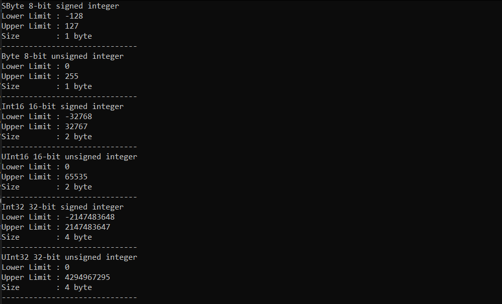

## [Arrays](https://github.com/AtakanTurgut/DataStructures_Basic/blob/main/arrays/arrays/Program.cs) 
Array   |   Dizi -> Arrays are of reference type.    
- It has a method that cleans up array parts.     
- Allows array definition by specifying the type.     
- It is a class that contains array functions.    
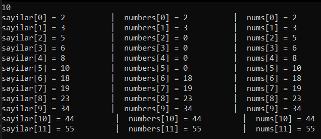

## [HashTables()](https://github.com/AtakanTurgut/DataStructures_Basic/blob/main/hashtables/hashtables/Program.cs) 
Hashtable   |       non-generic -> object -> boxing/unboxing     
- key - value pairs | ConteinKey - ContainValue           (key, value)     
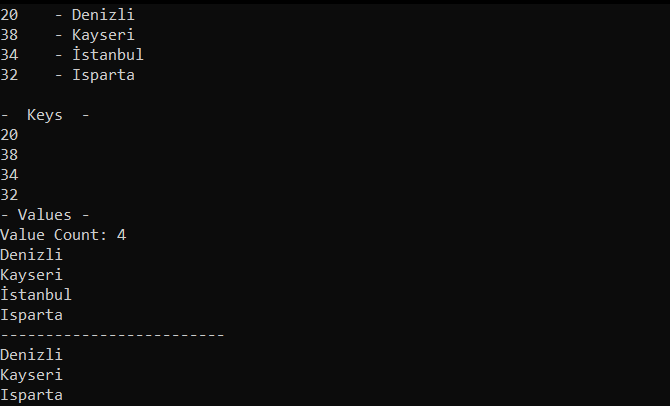 

## [SortedLists()](https://github.com/AtakanTurgut/DataStructures_Basic/blob/main/sortedlists/sortedlists/Program.cs) 
SortedList  |       non-generic -> object    
- key - value pairs  |   Sort by insertion added.  |   Sorts ascending.       (key, value)     
- Access can be provided by key and index.  |  IndexOfKey - IndexOfValue  ->  GetKey - GetValue     
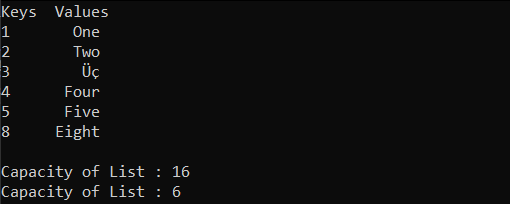 

## [Lists<-T->](https://github.com/AtakanTurgut/DataStructures_Basic/blob/main/lists/lists/Program.cs)
List<-T->   |       Type Safety  -> generic      
- Interface -> Inheritance : Inherits contracts.   
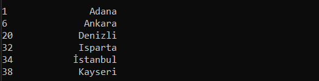 

## [Stacks<-T->](https://github.com/AtakanTurgut/DataStructures_Basic/blob/main/stacks/stacks/Program.cs) 
Stack<-T->  |  Yığın           Type Safety  -> generic      
- Last-in First-out     ->  LIFO       
- .push() -> Ekleme          .pop() -> Çıkarma        .Clear() -> Yığını boşaltma        .ToArray() -> int[]      
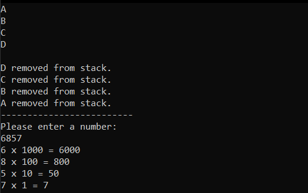 

## [Queues<-T->](https://github.com/AtakanTurgut/DataStructures_Basic/blob/main/queues/queues/Program.cs) 
Queue<-T->  |   Kuyruk         Type Safety  -> generic     
- First-in First-out    ->  FIFO   
- .Enqueue() -> Ekleme       .Dequeue() -> Çıkarma     
- The Operating System is used to set operating priorities.    
- -> İşletim sistemlerinde çalışma önceliğini belirlemede kullanılır.    
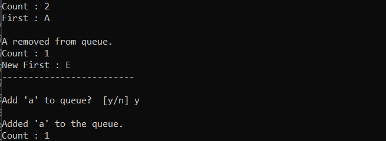

## [LinkedLists<-T->](https://github.com/AtakanTurgut/DataStructures_Basic/blob/main/linkedlists/linkedlists/Program.cs) 
LinkedList<-T->  |  Bağlı Liste           Type Safety  -> generic   
- Non-sequential, linear data structure.   
- .AddFirst()      .AddLast()      .First()    .Last()     .AddBefore()    .AddAfter()     

            Node   ==   - | data | pointer
            <- | previous | data | next | ->
            firstNode ... lastNode
            
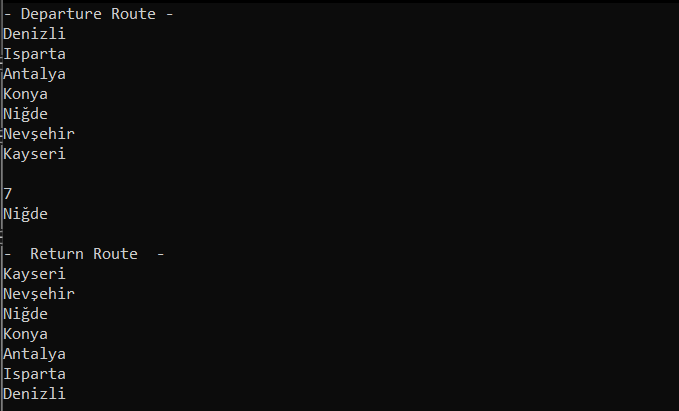

## [Dictionaries<-TKey, TValue->](https://github.com/AtakanTurgut/DataStructures_Basic/blob/main/dictionaries/dictionaries/Program.cs) 
Dictionary<-TKey,  TValue->    |         Type Safety  -> generic       
- TKey -> It must be unique.   |    TValue -> The value you want.        
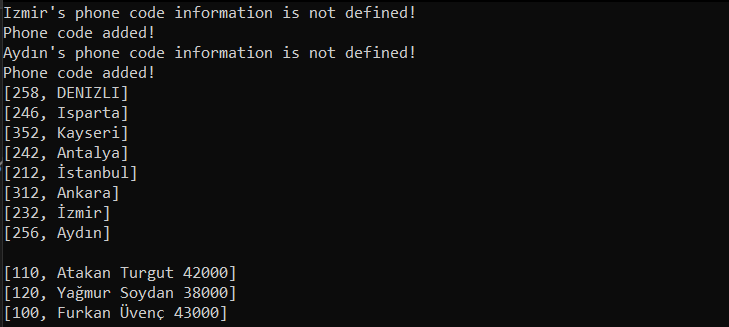

## [SortedDictionaries<-TKey, TValue->](https://github.com/AtakanTurgut/DataStructures_Basic/blob/main/sorteddictionaries/sorteddictionaries/Program.cs) 
SortedDictionary<-TKey,  TValue->    |        Type Safety  -> generic       
- TKey -> It must be unique.   |    TValue -> The value you want.        
- Sorting is done by the expression 'TKey'.        
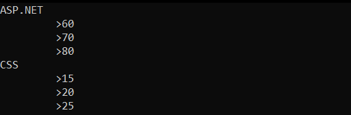

## [SortedSets<-T->](https://github.com/AtakanTurgut/DataStructures_Basic/blob/main/sortedsets/sortedsets/Program.cs) 
SortedSet<-T->    |   Type Safety -> generic  |  dynamic       
- Elements must be different from each other.      
- intersect,  union,  except,  subset      
- -> kesişim, birleşim, ayrışım, alt küme     
            
         A = { 1, 2, 3, 4 }          B = { 1, 2, 5, 6 }
             A.UnionWith(B) -> { 1, 2, 3, 4, 5, 6 }
             A.IntersectWith(B) -> { 1, 2 }
             A.ExceptWith(B) -> { 3, 4 }
             B.ExceptWith(A) -> { 5, 6 }
             A.SymmetricExceptWith(B) -> { 3, 4, 5, 6 }
            
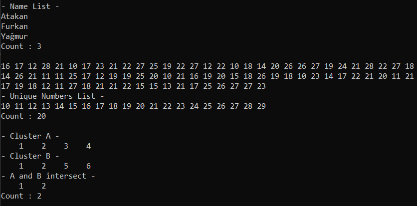

## [HashSets<-T->](https://github.com/AtakanTurgut/DataStructures_Basic/blob/main/hashsets/hashsets/Program.cs) 
HashSet<-T->    |    Type Safety -> generic       
- Elements must be different from each other, but non-sorted.      
- intersect,  union,  except,  subset      
- -> kesişim, birleşim, ayrışım, alt küme     
            
         A = { 1, 2, 3, 4 }          B = { 1, 2, 5, 6 }
             A.UnionWith(B) -> { 1, 2, 3, 4, 5, 6 }
             A.IntersectWith(B) -> { 1, 2 }
             A.ExceptWith(B) -> { 3, 4 }
             B.ExceptWith(A) -> { 5, 6 }
             A.SymmetricExceptWith(B) -> { 3, 4, 5, 6 }
            
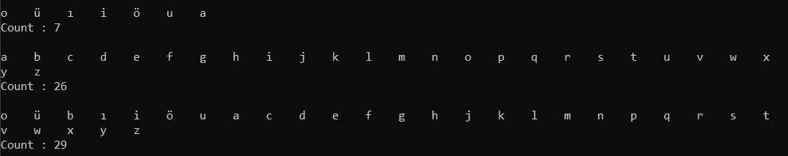